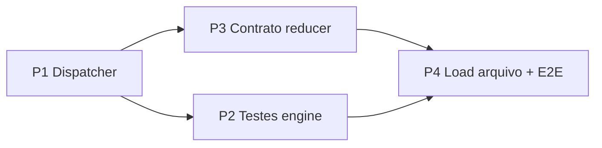

# Plano de hardening do mixer — índice orquestrador

Documentação para handoff a um agente de implementação. **Contratos são extensíveis**: ondas futuras podem alterar tipos, rotas e arquivos sem quebrar o espírito do plano.

## Ordem de execução

| Onda | Documento | Objetivo | Estimativa |
|------|-----------|----------|------------|
| **P1** | [mixer-prioridade-1-dispatch.md](./mixer-prioridade-1-dispatch.md) | Extrair `mixer-dispatch.ts`, browse e snapshot | 1–2 dias |
| **P2** | [mixer-prioridade-2-engine-tests.md](./mixer-prioridade-2-engine-tests.md) | Vitest + harness do `MamuteEngine` | 1–2 dias |
| **P3** | [mixer-prioridade-3-reducer-contract.md](./mixer-prioridade-3-reducer-contract.md) | Tabela de rotas + guards dev | 0,5–1 dia (após P1) |
| **P4** | [mixer-prioridade-4-spec.md](./mixer-prioridade-4-spec.md) | Load MP3, pipeline áudio, E2E, waveform | 3–5 dias (após P1–P3) |

**P2 e P3** podem correr em paralelo após P1.

## Princípios (não congelar)

1. **`MixerAction`** — union aberto; novos `type` exigem linha na tabela de rotas (P3) e case no dispatcher (P1).
2. **`MixerEngine`** — interface mínima injetável; não importar React no `lib/`.
3. **Estado de UI** (cursor browse, modal load, file input) fica no React; o dispatcher emite `UiOp` opcionais.
4. **Testes** — unitários para lógica pura; e2e para DOM + inject MIDI; não duplicar `midi-map.spec.ts`.

## Critério de pronto global

- [ ] `npm run test:unit` verde (após P2)
- [ ] `midi-inject.spec.ts`, `midi-map.spec.ts`, `mixer.spec.ts` verdes
- [ ] `mixer-dispatch-contract.spec.ts` verde (P3)
- [ ] `mixer-deck-load.spec.ts` verde (P4)
- [ ] Docs atualizados em `src/types/mixer.ts` e `src/lib/README.md`

## Referências existentes

- [mixer-midi-escopo-2.md](./mixer-midi-escopo-2.md) — o que o engine finge hoje vs ondas 7–12
- [arquitetura.md](./arquitetura.md) — visão geral da SPA
