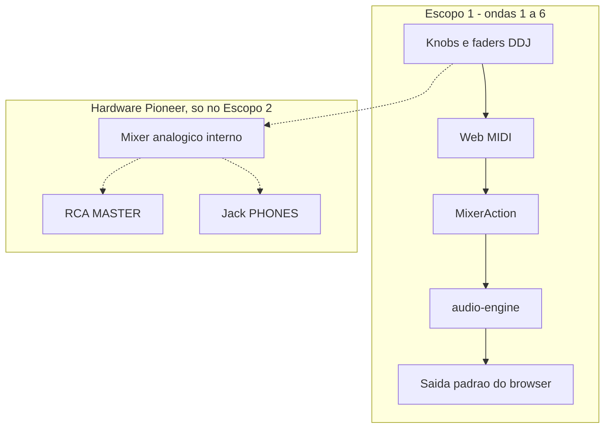

# Referência técnica — Escopo 2 do MIDI da DDJ-400

O projeto MIDI da DDJ-400 tem **dois escopos**, e a fronteira entre eles é o `audio-engine`.

No **Escopo 1**, que são as ondas 1 a 6, a controladora entra como **emissor de `MixerAction`** e o engine só recebe setters que já existem. Por isso nada lá muda o som, ou seja, a DDJ-400 vira controle da cabine na tela.

No **Escopo 2**, que são as ondas 7 a 12, o grafo de áudio muda e o que hoje é LED virtual passa a ser som. Este documento é a referência técnica dele: item por item, o que o `audio-engine` finge hoje, por que finge, e o que precisaria existir para parar de fingir.

Este arquivo **não** é mais uma lista de exclusões, e sim o detalhamento do escopo seguinte. O plano com a ordem e as whitelists é o "Escopo 2 — Booth de verdade".

Quando um byte já tem constante em [`ddj-400-protocol.ts`](../src/lib/midi/ddj-400-protocol.ts), este documento cita o **nome**, como `DECK_NOTE.reloop`. O literal hexadecimal aparece só nos controles que ainda não foram materializados, a saber Beat FX, sampler, beat jump e as combinações com SHIFT.

## Dois caminhos de áudio

A DDJ-400 é **interface de áudio USB** e **controladora MIDI** ao mesmo tempo. O Escopo 1 só usa o segundo papel.

Mover um fader na DDJ-400 **pode** mudar o snapshot do Mamute **e** o mixer analógico interno da Pioneer, porque são circuitos distintos. Até a onda 7 o treino continua saindo pelos alto-falantes do PC, ao passo que RCA e fone da controladora só ouvem o que o hardware Pioneer mistura sozinho.

## O que o engine já finge na UI

Estes campos existem no snapshot e na tela, e as ondas do Escopo 1 **copiam** o valor MIDI para o knob. O som **não** muda, porque o método só grava o número.

| Campo | Onde a UI mostra | O que `audio-engine` faz hoje | Por que o áudio fica fora | Onda que resolve |
| --- | --- | --- | --- | --- |
| `booth` | VolumeKnob BOOTH | `setBooth` só atribui `snapshot.booth` | Não existe bus de monitor separado. Um único `GainNode` master alimenta o destino do `AudioContext`. | 7 |
| `cueMix` | VolumeKnob CUE MIX | `setCueMix` só atribui `snapshot.cueMix` | Não existe mix cue/master para fone, nem `destination` de headphone. | 7 |
| `cueMonitor` | botão PFL de canal | `setCueMonitor` só liga o LED virtual | PFL de verdade pediria um grafo cue: a deck com PFL vai ao fone, sem vazar no master. | 7 |
| `quantize` | toggle na deck | `setQuantize` só grava o boolean | Cue, loop e hot cue **não** arredondam para o grid quando o flag está ligado. | 8 |
| `loop` | LED LOOP | `toggleLoop` marca `inBeat`/`outBeat` de 4 beats | O `BufferSource` já faz `source.loop = true` no loop sintético inteiro, e por isso o loop de 4 beats não recorta o áudio. | 8 |
| `jogMode` | toggle VINYL/CDJ | só muda o tamanho do `nudge` | Scratch vinyl **não** existe, porque o source só aceita `start(offset)` uma vez. | 9 |
| `hotCues` | nenhum pad visível | 4 slots, slot 1 já nasce `set` | O e2e exige `document.querySelectorAll(".cdj-hotcue").length === 0`. | 11 |

Consequência para o Escopo 1: mapear HEADPHONES MIXING para `cueMix`, HEADPHONES LEVEL para `booth` e PFL para `cueMonitor` é **feedback visual**. O certo é não chamar isso de cue de fone até a onda 7 existir.

---

## 1. LEDs da controladora — onda 10

**O que é.** A DDJ-400 aceita MIDI **out**, ou seja, o software manda um Note On no mesmo status e na mesma note que a entrada usa, e o botão físico acende. O que liga e desliga é a **velocity**, isto é o terceiro byte, sendo que `0x7F` acende e `0x00` apaga. Não existe Note Off de status `0x80` nesse mapa, porque Note On com velocity zero já apaga pela convenção MIDI. O XML do Mixxx confirma os dois valores, já que os 112 blocos `<output>` trazem `<on>0x7F</on>` e nenhum declara `<off>`, sendo `0x00` o default da tag.

**Por que não está no Escopo 1.** As ondas 1 a 6 só **leem** `MIDIInput`. Abrir `MIDIOutput` e espelhar play, cue, sync, PFL e hot cue é um segundo ciclo de vida, porque cada `dispatch` passaria a exigir um `syncLeds(snapshot)` depois do reducer.

**O que seria preciso.**

- Guardar o `MIDIOutput` cujo nome contém `DDJ-400`, o que **reabre** o `midi-session.ts` que nasceu só de leitura.
- Tabela inversa do mapper, traduzindo `MixerSnapshot` numa lista de `[status, note, velocity]` e reusando `DDJ_STATUS` e `DECK_NOTE`, porque o endereço de saída é o mesmo da entrada.
- Enviar só o delta, senão o USB satura a cada refresh de 80 ms do `MixerBoard`.
- Tratar desconexão, ou seja, se o output some o chip volta para "desconectada" e **não** lança no reducer.

**Dependência.** Escopo 1 inteiro, porque LED é espelho e não há o que espelhar antes de play, sync, PFL e hot cue existirem no MIDI in.

**Não confundir.** MASTER CUE e MASTER LEVEL da Pioneer são **hardware** no caminho analógico, e mandar LED nesses controles **não** mexe no volume do RCA.

---

## 2. Áudio na interface Pioneer — onda 7

**O que é.** O Windows já lista `Line (2- DDJ-400)` como endpoint, e o browser pode, em tese, apontar o áudio para esse device via `setSinkId`.

**Por que isso sozinho não resolve.** `sinkId` **não** liga o fone da controladora ao cue do Mamute, porque o jack PHONES da DDJ-400 escuta o mixer **analógico interno**, que mistura o que entra nos canais USB da Pioneer, e não o grafo Web Audio. No máximo ele manda o **master do browser** para o par USB que a Pioneer rotula como software, ao passo que booth e cue continuam no hardware.

Por isso a onda 7 **funde** o grafo de cue com o `sinkId`, e a fusão é técnica: um bus de cue que desemboca no mesmo `destination` do master não é cue e sim mistura, cujo único efeito seria o PFL rebaixar o master.

**O que seria preciso para um fone de verdade.**

1. Grafo cue no engine, com `masterGain` indo ao destino principal e `cueGain` indo a um destino separado.
2. Dois destinos de device, o que no Chromium pede `MediaStreamAudioDestinationNode` mais um `HTMLAudioElement` com `setSinkId`, porque o `AudioContext` tem um `destination` só.
3. Um spike antes do código, para descobrir se algum endpoint USB da Pioneer alcança o jack PHONES e sob qual posição do HEADPHONES MIXING físico. Se nenhum alcançar, o cue honesto é o fone na placa do PC, e a Pioneer fica só com o master.
4. Sem isso, o atalho honesto é o usuário escolher "DDJ-400" como saída do sistema ou do Chrome, e aí master e cue saem no mesmo cabo, sendo que o knob PHONES da Pioneer só atenua o que já veio misturado.

**Riscos.** O `MediaStreamAudioDestinationNode` acrescenta latência e um resample, o que pode ser audível justamente em treino de beatmatch. Aqui Firefox e Safari ficam fora não só pelo Web MIDI, e sim pelo `setSinkId` por stream.

**O que a Pioneer faz sozinha, e o software não deve mapear.**

- Knob MASTER físico: o Mixxx documenta como implementado em hardware. **Não** mandar para `setMaster`, porque esse método escreve em `this.master.gain.value` e atenua o Web Audio de verdade. Se um dia o `sinkId` apontar para a Pioneer, o volume cairia duas vezes, uma no analógico e outra no grafo.
- MASTER CUE no mixer: roteia master para o fone **dentro** da Pioneer. Ele ficou fora da onda 2 do Escopo 1 exatamente por isso, e entra na onda 7 junto do bus, ganhando `masterCue` no `MixerSnapshot`, botão `aria-pressed` no `MixerConsole` e constante nova no protocolo.

**O que já entrou no Escopo 1.** HEADPHONES MIXING, ou seja `MIXER_CC_14BIT.headphonesMixing`, vai para `cueMix`, e HEADPHONES LEVEL, ou seja `MIXER_CC_14BIT.headphonesLevel`, vai para `booth`, reusando o VolumeKnob BOOTH da cabine. O critério é o **método do engine**, e não o rótulo do knob, porque `setCueMix` e `setBooth` apenas atribuem um número ao snapshot ao passo que `setMaster` altera ganho audível. Por isso os dois knobs de fone são feedback visual sem risco de ganho duplicado.

Deixe claro na UI que esses knobs da tela **não** são os knobs PHONES da Pioneer. Além disso, quando a onda 7 transformar o `booth` num bus de monitor real, **revise esse mapa**, porque aí o knob físico passaria a atenuar o analógico e o `setBooth` o digital ao mesmo tempo.

---

## 3. Pads visuais na cabine — onda 11

**O que é.** Oito performance pads por deck, com modo Hot Cue, Beat Loop, Beat Jump e Sampler.

**Como o hardware sinaliza o modo.** A captura com a controladora real identificou os botões de modo, que o mapa do Mixxx não descreve. HOT CUE é a note `0x1B`, BEAT LOOP é `0x6D`, BEAT JUMP é `0x20` e SAMPLER é `0x22`. Com SHIFT vêm os quatro modos secundários, a saber `0x69`, `0x1E`, `0x6B` e `0x6F`, na mesma ordem dos botões.

Os dois decks usam as **mesmas** notes, e o que os separa é o canal, portanto esses botões seguem a regra geral do mapa em vez de abrirem exceção. O teste cruzado rodou nos dois lados e deu idêntico.

Ler esses botões, porém, é desnecessário, porque a controladora **já troca a note do pad** conforme o modo. O pad 1 manda `0x00` em Hot Cue, `0x60` em Beat Loop, `0x20` em Beat Jump e `0x30` em Sampler, tanto sob `notePadDeckA` quanto sob `notePadDeckB`, e nos modos secundários a faixa começa em `0x70`. Por isso o mapper filtra pela faixa de note e dispensa qualquer estado de modo, no mesmo princípio do SHIFT.

**Por que não está no Escopo 1.** O bloqueio é contratual, e não técnico, porque [`tests/e2e/mixer.spec.ts`](../tests/e2e/mixer.spec.ts) falha se existir `.cdj-hotcue`, e por isso a onda 5 dispara `setHotCue` e `triggerHotCue` **sem** pintar pad.

**O que seria preciso.**

- Componente de 4 pads, porque `HOT_CUE_SLOTS` é 4 ao passo que a DDJ-400 tem 8. Ou os pads 5 a 8 ficam mortos, ou o engine ganha 8 slots e o `DeckState` muda.
- Classe **sem** o seletor `.cdj-hotcue`, **ou** o e2e deixando de exigir zero pads, com o commit explicando a mudança em vez de um seletor que engane a asserção.
- `aria-label` em cada pad, senão o teste de unlabeled quebra junto.

**Dependência.** Onda 5 estável e mudança consciente do e2e.

---

## 4. Scratch vinyl de verdade — onda 9

**O que `nudge` faz hoje.** Soma um delta curto em `phase` e empurra `playbackRate` por 120 ms. O jog da onda 4 **reutiliza** isso de propósito.

**O que scratch pede.** Enquanto o prato está tocado, isto é enquanto `DECK_NOTE.jogTouch` estiver marcado, cada CC relativo de `DECK_CC_JOG.platterVinyl` desloca o playhead na proporção do ângulo, **sem** voltar ao pitch original até o release. O vinyl mode manda `platterVinyl`, ao passo que o CDJ mode manda `DECK_CC_JOG.platterCdj`.

**O que seria preciso no engine.**

- `scratchBegin(id)`, `scratchTick(id, delta)`, `scratchEnd(id)` e `seek(id, phase)`.
- Recriar o `AudioBufferSourceNode` a cada tick, **ou** trocar por um grafo que permita seek contínuo, porque o source atual só faz `start(offset)` uma vez. Essa decisão é o coração da onda.
- Distinguir `jogMode === "vinyl"` de `"cdj"`, porque vinyl raspa e CDJ só faz pitch bend, ao passo que hoje os dois apenas mudam o tamanho do bump.

**Dependência.** Onda 4 para o CC relativo e o touch, mais a onda 8, porque loop real e scratch pedem a mesma reforma na fase e fazer scratch antes pagaria a conta duas vezes. Sem seek contínuo, **não** implemente scratch no mapper.

O jog com SHIFT, que é o fast search no CC `0x29` e usaria o `JOG_FAST_SEEK_SCALE` já guardado no protocolo, entra nesta onda pela mesma dependência.

---

## 5. Loop de 4 beats de verdade — onda 8

**O que `toggleLoop` faz hoje.** Liga um flag, grava `inBeat` e `outBeat`, e acende o LED LOOP. O áudio **não** recorta, porque o source já dá loop no buffer de 8 beats sintéticos.

**O que a DDJ-400 manda.** LOOP IN em `DECK_NOTE.loopIn`, LOOP OUT em `DECK_NOTE.loopOut`, RELOOP/EXIT em `DECK_NOTE.reloop`, e SHIFT+IN/OUT para ajustar pontos no jog, que ainda não tem constante.

**Por que a onda 5 fica rasa.** O engine **não** separa in de out, e por isso os três botões dividem um método só. A onda 5 tirou disso o máximo possível sem tocar no engine, ou seja, IN e OUT viram pedidos de **estado** que só chamam `toggleLoop` quando ele mudaria alguma coisa, ao passo que RELOOP alterna. Os três gestos ficam distintos e previsíveis, mas continuam sendo LED, porque o áudio não recorta. Loop in e out independentes, half e double em `0x51` e `0x53`, e beat loop nos pads da faixa `0x60` pedem recorte real na fase.

**O que seria preciso.** Na `startPhaseLoop`, com `loop.active`, a fase que passa de `outBeat` volta para `inBeat` e reinicia o source. O `quantize` passa a arredondar in e out para o grid, em vez de só guardar um boolean. Métodos novos: `setLoopIn`, `setLoopOut`, `loopHalve`, `loopDouble` e `setBeatLoop(beats)`.

---

## 6. Cue de deck vs PFL — resolvido em dois escopos

A Pioneer tem dois "CUE", e eles se resolvem em escopos diferentes.

- **CUE da deck**, em `DECK_NOTE.cue`, faz set e call do ponto de cue, como num CDJ. O engine já tem `setCueBeat` e `callCue`, e por isso a onda 3 do Escopo 1 converte o botão da deck em set e call.
- **CUE de canal, isto é o PFL**, em `DECK_NOTE.pfl`, manda o canal para o fone. No Mamute isso é `cueMonitor`, e a onda 3 cria o PFL de canal no `MixerConsole` para o `cueMonitor` não ficar sem alvo visível quando o botão da deck mudar de papel.

Ou seja, as **ações** ficam corretas já no Escopo 1, ao passo que o **ouvido** só ganha cue de fone na onda 7. Antes dela, o PFL continua sendo LED.

---

## 7. Beat FX — projeto próprio

**O que a DDJ-400 tem.** Seletor BEAT FX, ON/OFF, LEVEL/DEPTH, assign de CH1, CH2 e MASTER, mais BEAT LEFT e RIGHT, no canal MIDI 5, isto é `0x94` e `0xB4`.

**Por que não é onda.** Não há `AudioWorklet`, convolver, delay nem echo no engine, porque EQ e filter são os únicos efeitos que existem. Isso é escopo de produto, e tratá-lo como onda daria a impressão falsa de estar a uma sprint de distância.

**O que seria preciso.** Um rack mínimo, por exemplo o filter existente mais delay e echo, com wet e dry no LEVEL/DEPTH. Sem isso, **não** engula os CCs de FX no mapper, senão o DJ gira o knob e nada acontece sem nem uma mensagem na tela.

---

## 8. Sampler — projeto próprio

**O que a DDJ-400 tem.** Modo SAMPLE nos pads, com 8 slots por lado.

**Por que não é onda.** O Mamute só tem duas decks de loop sintético, ou seja, não há buffer de sample, load de arquivo nem deck sampler.

**O que seria preciso.** Um terceiro tipo de voice no engine, UI de 8 slots, e política de arquivo local, porque stream licenciado **não** entra no mixer. Isso colide com o escopo descrito em [`planejamento.md`](planejamento.md).

---

## 9. Beat jump, slip, reverse — onda 12

| Controle MIDI | Função Pioneer | Engine hoje | Custo |
| --- | --- | --- | --- |
| Pads beat jump `0x20`–`0x27` | Pula N beats | Não existe `jumpBeats` | Barato, porque dá para simular com `phase` mais restart |
| Play+SHIFT `0x47` | Reverse roll / censor | Não existe playback reverso | Médio, porque o grafo **não** trata rate negativo |
| Slip | Continua a timeline por baixo do loop ou do scratch | `phase` é um único relógio | Caro, porque pede um relógio fantasma paralelo ao audível |

O beat jump segue o padrão do hot cue e pede só um `jumpBeats(id, n)`. O reverse pede buffer invertido ou outro caminho de leitura. O slip pede que a fase deixe de ser um relógio de mão única.

---

## 10. Browser e LOAD — fechado no Escopo 1

**Este item virou a onda 6 do Escopo 1**, depois que a captura com a controladora real confirmou os três endereços, que agora são `MIXER_CC_BROWSE` no canal do mixer, mais `BROWSER_NOTE.load.a`, `load.b` e `back` no canal `DDJ_STATUS.noteBrowser`.

O que destravou a decisão foi perceber que `loadTrack` **já existe** no `MixerAction` e no reducer, porque o `<select>` de `CdjDeck` o usa desde sempre. Ou seja, faltava apenas um cursor de UI sobre `TRAINING_TRACKS`, e não uma capacidade nova no engine.

Continua **fora** o que a cabine realmente não tem, a saber árvore de biblioteca, busca e crates, que são projeto próprio. Por isso o BACK, que no Mixxx alterna entre lista e árvore, na onda 6 apenas realinha o cursor com o deck master.

Atenção ao decodificador. O encoder BROWSE manda complemento de dois em 7 bits, e não um valor em torno de `0x40` como o jog, e por isso ele usa `encoderDelta` e **não** `jogDelta`. Trocar um pelo outro faz o cursor andar 63 posições por clique.

---

## 11. Faixa de tempo e MASTER hardware

O pitch da cabine é fixo em −8% a +8%, ao passo que SHIFT+SYNC na Pioneer cicla ±6, ±10, ±16 e wide. Mapear isso **sem** alargar o slider da UI deixaria o fader físico e o da tela dessincronizados, e por isso a ciclagem entra na onda 12 junto de uma faixa variável na UI.

O MASTER físico **não** deve ir para `setMaster` enquanto o áudio sair no PC. E se a onda 7 apontar o `sinkId` para a Pioneer, ele continua fora, porque aí o knob já atenua o analógico e o `setMaster` **duplicaria** a atenuação.

---

## 12. Ambiente, porta e protocolo

**Web MIDI.** Chrome e Edge, sendo que Firefox e Safari ficam fora até a API existir. A onda 1 mostra "MIDI indisponível", e **não** tenta polyfill.

**Uma porta por vez no Windows.** Rekordbox, Mixxx ou Serato com a DDJ-400 aberta fazem o `requestMIDIAccess` do Mamute ver o device ocupado ou mudo, porque não há multiplex no browser. O chip MIDI deve dizer para fechar o outro software.

**HID Pioneer.** O rekordbox usa HID além de MIDI para jog de alta resolução e alguns LEDs, ao passo que WebHID é outra permissão e outro mapa, e por isso não entra em nenhum dos dois escopos. Sysex também fica fora, e o parser da onda 1 ignora o que não é CC ou note.

**Vários devices.** O filtro é o nome `DDJ-400`, e outra controladora class-compliant **não** entra sem um segundo arquivo de mapa, no estilo Meax.

**HTTPS.** Em produção Netlify já é HTTPS, ao passo que em `file://` o Web MIDI **não** aparece.

---

## 13. Teste com hardware

O repositório só tem Playwright, e não há harness que injete `MIDIAccess` falso no Chromium de CI. Por isso as ondas testam o mapper **puro** no Node, mais o inject por `window.__mamuteMidiInject`, ao passo que o plug da DDJ-400 real continua checklist manual:

1. Fechar o Rekordbox.
2. Chrome em `localhost`.
3. Conceder MIDI.
4. Conferir o chip "DDJ-400 conectada".
5. Fader A, Play A, pitch, jog, pad 1.

CI **não** substitui esse passo, e automatizar hardware fica fora dos dois escopos.

---

## Índice de item para onda

| Item deste documento | Onde resolve |
| --- | --- |
| Grafo de cue, `booth`, `cueMix`, PFL audível, `sinkId`, MASTER CUE | Onda 7 |
| Loop que recorta fase, in/out independentes, half e double, quantize efetivo | Onda 8 |
| Seek contínuo, scratch vinyl, fast search com SHIFT | Onda 9 |
| LEDs por MIDI out | Onda 10 |
| Pads visíveis e mudança do e2e de hotpads | Onda 11 |
| Beat jump, reverse, slip, faixa de tempo | Onda 12 |
| Beat FX, sampler, biblioteca com árvore e busca | Projeto próprio, sem onda |
| HID, sysex, segunda controladora, CI com hardware | Fora dos dois escopos |

A onda 7 é a que destrava o treino de fone descrito em [`courses.ts`](../src/data/courses.ts). Sem ela, a DDJ-400 no Mamute é **controle da cabine na tela**, e não booth.
