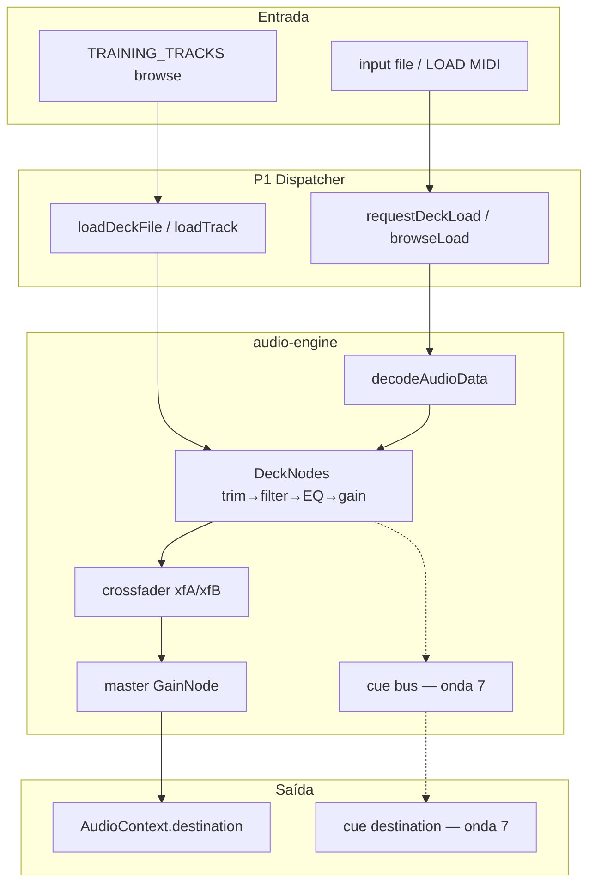

# Prioridade 4 — Load de arquivo, pipeline áudio real, E2E e waveform

Ver [plano orquestrador](./mixer-hardening-plano.md). **Pré-requisitos:** P1 (dispatcher), P2 (engine tests), P3 (contrato).

Contratos aqui são **sugestões** — ondas futuras podem renomear tipos e mover arquivos.

---

## 1. Waveform hoje (como o CDJ virtual exibe)

Implementação em `src/components/mixer/CdjDeck.tsx`, função `Waveform` (linhas ~7–81).

### Camadas de desenho (canvas 2D, `requestAnimationFrame`)

| Camada | Fonte de dados | Comportamento |
|--------|----------------|---------------|
| **Fundo** | fixo | retângulo escuro `rgba(7,11,18,0.92)` |
| **64 barras** | `Math.sin(bar * 0.55 + phase * 2π)` | **Decorativo** — não reflete o áudio da faixa; altura varia com `phase` do deck |
| **Playhead** | `deck.phase` (0–1) | linha vertical amarela `#ffe08a` |
| **Overlay ondulado** | `engine.analyser(id).getByteTimeDomainData(256)` | Só se `ensure()` rodou; linha time-domain do **sinal já misturado no grafo** (pós-EQ/gain), não waveform estática da música |

### De onde vem `phase`

- `audio-engine.ts` atualiza `snapshot[id].phase` a cada **50 ms** enquanto `playing`
- Fórmula: `((elapsed * rate) / loopDuration) % 1`
- Para loops **sintéticos** de 2 compassos; para MP3 real será `positionSec / durationSec`

### Limitação atual

As barras **não** são picos da faixa carregada. O overlay do analyser só aparece **durante play** e mostra forma de onda instantânea, não a visão tipo CDJ (waveform completa com playhead).

### Melhoria P4 (mínima, sem redesign visual)

1. Após decode do arquivo, pré-computar `Float32Array` de picos (ex.: 512 bins por duração).
2. Desenhar barras a partir de `peaks[bar]` em vez de `sin`.
3. Playhead continua em `phase` / `positionSec`.
4. Manter overlay do analyser opcional durante play (feedback “vivo”).

**Arquivos:** `src/lib/waveform-peaks.ts` (novo), `CdjDeck.tsx` (passar `peaks` do snapshot ou prop).

---

## 2. Pipeline alvo: arquivo → master



### Fase 4.0 — Fundação (com P1–P3)

Sem mudança de áudio; só dispatcher + contratos.

### Fase 4.1 — MVP load MP3 (esta prioridade)

| Capacidade | Estado alvo |
|------------|-------------|
| LOAD virtual (botão por deck) | abre `<input type="file" accept="audio/*">` |
| LOAD físico (`browseLoad`) | **modo configurável:** biblioteca treino (hoje) **ou** file picker (flag/prop) |
| Decode | `AudioContext.decodeAudioData` |
| Play / pause | `toggle` existente |
| BPM na tela | metadata do arquivo **ou** BPM manual / heurística simples **ou** fallback `TrainingTrack` |
| KEY na tela | metadata ID3 **ou** input manual **ou** placeholder “—” |
| CUE | `cueBeat` em **segundos** no buffer real (`positionSec`) |
| Crossfader / EQ / gain | já funcionam no grafo |
| Waveform | picos pré-computados |

### Fase 4.2 — Metadados e storage

- IndexedDB para uploads por deck (`mixer-deck-storage.ts`, espelho de `radio-storage.ts`)
- Re-load de faixas recentes sem re-upload

### Fase 4.3 — Escopo 2 onda 7 (fone / cue)

- `cueMonitor` roteia deck ao bus cue
- `cueMix`, `booth` com nós reais
- Ver [mixer-midi-escopo-2.md](./mixer-midi-escopo-2.md) §2

### Fase 4.4 — Escopo 2 ondas 8–12

| Onda | Feature | Engine |
|------|---------|--------|
| 8 | Loop 4 beats real | `source.loopStart/End` em segundos |
| 8 | Quantize | arredondar cue/loop ao grid |
| 9 | Scratch vinyl | seek contínuo / buffer source restart |
| 10 | LED MIDI out | fora do engine |
| 11 | Pads visuais `.cdj-hotcue` | UI + relaxar `mixer.spec.ts` hotpads=0 |
| 12 | Beat jump / sampler | novos `MixerAction` |

---

## 3. Extensões MixerAction (flexíveis)

```typescript
// types/mixer.ts — adicionar ao union (nomes podem mudar)

/** Intenção: abrir seletor de arquivo para o deck indicado. */
| { type: "requestDeckLoad"; id: DeckId; source?: "file" | "library" }

/** UI interna após arquivo escolhido — não vem do MIDI. */
| { type: "loadDeckFile"; id: DeckId; file: File }  // ou ArrayBuffer + meta

/** Atualizar metadados exibidos sem recarregar áudio. */
| { type: "setDeckMeta"; id: DeckId; bpm?: number; key?: string; title?: string }
```

### UiOp no dispatcher (P1)

```typescript
export type MixerUiOp =
  | { kind: "openFilePicker"; deckId: DeckId }
  | { kind: "showLoadError"; message: string };
```

`browseLoad` em modo arquivo → `openFilePicker` em vez de `loadTrack` da biblioteca.

---

## 4. Arquivos CREATE

| Arquivo | Papel |
|---------|--------|
| `src/lib/mixer-deck-storage.ts` | IndexedDB: uploads por deck (opcional 4.2) |
| `src/lib/deck-audio-decode.ts` | `decodeDeckFile(ctx, file) → { buffer, durationSec, title? }` |
| `src/lib/waveform-peaks.ts` | `computePeaks(buffer, binCount) → Float32Array` |
| `src/lib/deck-metadata.ts` | BPM/key heurística ou parse ID3 leve (opcional) |
| `src/components/mixer/DeckFileInput.tsx` | `<input hidden>` + trigger por deck |
| `tests/fixtures/mixer-kick-120bpm.mp3` | MP3 curto sintético (~2s) para CI |
| `tests/fixtures/README.md` | Como regenerar fixture |
| `tests/unit/deck-audio-decode.spec.ts` | Decode + peaks |
| `tests/unit/waveform-peaks.spec.ts` | Bins não vazios |
| `tests/e2e/mixer-deck-load.spec.ts` | **E2E principal P4** |
| `tests/e2e/helpers/mixer-deck-load.ts` | `uploadToDeck(page, deck, path)` |

## 5. Arquivos MODIFY

| Arquivo | Mudança |
|---------|--------|
| `src/lib/audio-engine.ts` | `loadDeckBuffer(id, buffer, meta)`, `DeckState` com `sourceKind: 'synthetic' \| 'file'`, `peaks`, `durationSec`, `positionSec` |
| `src/types/mixer.ts` | Novos actions, campos em `DeckState` |
| `src/lib/mixer-dispatch.ts` | `requestDeckLoad`, `loadDeckFile` |
| `src/components/mixer/MixerBoard.tsx` | `DeckFileInput`, handler `onUiOp` |
| `src/components/mixer/CdjDeck.tsx` | Botão LOAD, waveform com peaks, `data-*` para e2e |
| `src/lib/midi/ddj-400-map.ts` | *(opcional)* flag modo load |
| `src/lib/README.md` | Novos módulos |

---

## 6. Engine: `loadDeckBuffer` (esboço)

```typescript
/**
 * Carrega áudio decodificado no deck, preservando playing se aplicável.
 * @param id Deck destino.
 * @param buffer Buffer decodificado do Web Audio.
 * @param meta BPM, key, title para UI.
 */
loadDeckBuffer(id: DeckId, buffer: AudioBuffer, meta: DeckFileMeta): void {
  const wasPlaying = this.snapshot[id].playing;
  if (wasPlaying) this.stop(id);
  this.decks![id].buffer = buffer;
  this.snapshot[id].sourceKind = "file";
  this.snapshot[id].durationSec = buffer.duration;
  this.snapshot[id].peaks = computePeaks(buffer, 512);
  this.snapshot[id].track = { ...meta display fields };
  this.snapshot[id].bpm = meta.bpm ?? this.snapshot[id].bpm;
  this.snapshot[id].pitch = 0;
  this.snapshot[id].cueBeat = 0; // ou segundos: renomear para cueSec
  this.snapshot[id].phase = 0;
  if (wasPlaying) this.start(id);
}
```

**Cue em arquivo real:** `setCueBeat` passa a aceitar segundos ou beats conforme `sourceKind`; `callCue` usa `start(0, cueSec)`.

---

## 7. E2E — `tests/e2e/mixer-deck-load.spec.ts`

### Setup

- `desktop-chrome` only (Web Audio + file input)
- Fixture: `tests/fixtures/mixer-kick-120bpm.mp3`
- `page.goto("/mixer")`
- Autoplay: primeiro `click` em Play após load (gesture)

### Casos

| ID | Nome | Passos | Asserts |
|----|------|--------|---------|
| E01 | LOAD virtual deck A | click "Carregar deck A" → setInputFiles(fixture) | `data-source-kind="file"`, título contém nome arquivo |
| E02 | Play após load | E01 → Play deck A | `data-playing="true"`, botão Pause visível |
| E03 | BPM exibido | fixture com BPM conhecido ou `data-bpm` setado | métrica BPM = 120 (±1) ou valor fixture |
| E04 | KEY exibida | meta injetada ou placeholder | KEY não vazio ou `data-key` presente |
| E05 | CUE grava e salta | pause → CUE → play → CUE | `data-phase` ou `data-cue-sec` volta ao ponto |
| E06 | LOAD deck B não afeta A | load A + load B | selects/data-deck independentes |
| E07 | LOAD MIDI deck A | inject `browseLoad` após encoder *(modo biblioteca)* | comportamento atual preservado |
| E08 | Crossfader com arquivo | play A → xf 1.0 | deck A audível via `data-xf` + RMS opcional |
| E09 | EQ após load | HIGH 100% | slider valor 100 |
| E10 | Waveform peaks | após load | canvas `data-peaks-ready="true"` |
| E11 | Sync entre decks | load A+B, sync B | pitch B ajustado (`data-pitch`) |
| E12 | Hot cue pad MIDI | inject pad vazio → gravar → pad salta | `data-phase` muda (como midi-inject) |
| E13 | Loop IN/OUT LED | inject loop notes | `data-loop-active` (LED; áudio loop real = 4.4) |
| E14 | PFL toggle | inject PFL | `aria-pressed` (áudio cue = 4.3) |

### Data attributes para testes (adicionar em `CdjDeck`)

```html
<div class="cdj-deck" data-deck="a"
  data-playing={deck.playing}
  data-phase={deck.phase}
  data-bpm={deck.bpm}
  data-key={deck.track.key}
  data-source-kind={deck.sourceKind}
  data-peaks-ready={peaks?.length > 0}
/>
```

### Helper upload

```typescript
export async function uploadToDeck(page: Page, deck: "a" | "b", filePath: string) {
  const input = page.locator(`input[data-deck-file="${deck}"]`);
  await input.setInputFiles(filePath);
  await expect(page.locator(`.cdj-deck[data-deck='${deck}']`)).toHaveAttribute("data-source-kind", "file");
}
```

### Limitações Playwright + áudio

| Problema | Workaround |
|----------|------------|
| Não “ouve” áudio | `data-playing`, RMS via `page.evaluate` no analyser |
| Autoplay policy | `click` Play após interação |
| Headless sem dispositivo | asserts de estado DOM + `decodeAudioData` ok |
| Flaky phase | `expect.poll` com timeout 3s |

```typescript
// RMS opcional em evaluate
const rms = await page.evaluate(async () => {
  const { engine } = await import("/src/lib/audio-engine.ts");
  await engine.ensure();
  const an = engine.analyser("a");
  if (!an) return 0;
  const buf = new Uint8Array(256);
  an.getByteTimeDomainData(buf);
  let s = 0;
  for (const v of buf) s += (v - 128) ** 2;
  return Math.sqrt(s / buf.length);
});
expect(rms).toBeGreaterThan(0); // só com play ativo
```

---

## 8. Testes unitários P4

| ID | Módulo | Caso |
|----|--------|------|
| U-01 | `deck-audio-decode` | MP3 fixture → `AudioBuffer` duration > 0 |
| U-02 | `deck-audio-decode` | arquivo inválido → throw |
| U-03 | `waveform-peaks` | peaks.length === binCount |
| U-04 | `waveform-peaks` | silêncio → amplitudes baixas |
| U-05 | `audio-engine` | `loadDeckBuffer` preserva playing |
| U-06 | `audio-engine` | `callCue` com buffer real usa segundos |
| U-07 | `mixer-dispatch` | `requestDeckLoad` → UiOp openFilePicker |
| U-08 | `mixer-dispatch` | `loadDeckFile` → `loadDeckBuffer` 1× |

---

## 9. Mapa hardware — atual vs alvo

| Controle | MIDI hoje | Áudio hoje | Alvo P4 / onda |
|----------|-----------|------------|----------------|
| PLAY | `toggle` | ✅ | ✅ com arquivo |
| CUE | `cueButton` | ✅ phase | ✅ segundos reais |
| SYNC | `toggleSync` | ✅ pitch | ✅ |
| LOAD | `browseLoad` | biblioteca treino | **file picker (4.1)** ou treino |
| BROWSE encoder | `browseMove` | cursor UI | igual |
| Channel fader | `gain` | ✅ | ✅ |
| Crossfader | `xf` | ✅ | ✅ |
| EQ / filter | `eq`, `filter` | ✅ | ✅ |
| Trim | `trim` | ✅ | ✅ |
| Hot cue pads | `hotCuePad` | ✅ lógica, sem UI | ✅ MIDI; UI onda 11 |
| Loop IN/OUT/RELOOP | `loopOn/Off/toggle` | LED só | loop áudio onda 8 |
| PFL | `toggleCueMonitor` | LED só | cue bus onda 7 |
| HEADPHONES knobs | `cueMix`, `booth` | snapshot | bus onda 7 |
| Jog / nudge | `nudge` | ✅ bump phase | scratch onda 9 |
| SHIFT combos | ignorados / parcial | — | mapear por onda |
| Beat jump / sampler pads | notes filtradas | — | onda 12 |

---

## 10. UI mínima (sem redesign)

1. Botão **LOAD** por deck (ao lado do select USB treino) → `requestDeckLoad`
2. `<input type="file" hidden data-deck-file="a|b">`
3. Waveform: trocar `sin` por `peaks` quando `sourceKind === "file"`
4. Manter select de treino para modo pedagógico sem arquivo

---

## 11. Dependências P1–P3

| Prioridade | Entrega usada em P4 |
|------------|---------------------|
| P1 | `onUiOp`, `createMixerDispatch`, browse separado |
| P2 | `loadDeckBuffer` testado com mock context |
| P3 | `requestDeckLoad` na tabela `dispatch-only` |

---

## 12. Definition of Done P4

- [ ] LOAD virtual carrega MP3 no deck correto
- [ ] Play/pause com buffer real
- [ ] BPM e KEY visíveis (metadata ou fallback documentado)
- [ ] CUE grava e retorna posição
- [ ] Crossfader + EQ funcionam com arquivo
- [ ] Waveform usa picos reais
- [ ] `mixer-deck-load.spec.ts` E01–E10 verdes
- [ ] `midi-inject.spec.ts` verde (modo biblioteca preservado)
- [ ] Unitários U-01–U-08 verdes

---

## 13. Ordem de PRs sugerida

1. `feat(mixer): engine loadDeckBuffer + peaks` + unit (P2/P4)
2. `feat(mixer): decode + DeckFileInput` + dispatch hooks (P1/P4)
3. `feat(mixer): waveform peaks draw` (CdjDeck)
4. `test(mixer): e2e mixer-deck-load` (E01–E14)
5. *(futuro)* cue bus, loop real, pads UI
